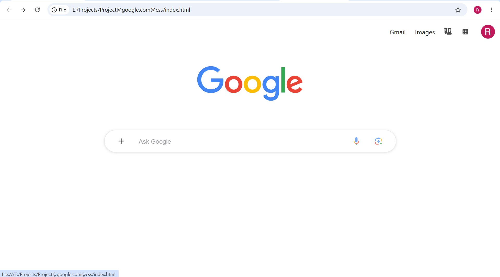

# Google New Tab Clone

A front-end clone of the modern Google New Tab page built entirely using **HTML5 and CSS3**.

This project recreates the appearance of Google's homepage while using HTML forms and links to provide a functional search experience and navigation—without using any JavaScript.

---

## ✨ Features

- 🔍 Functional Google search bar
- 🌐 Searches directly on Google
- 📧 Working Gmail link
- 🖼️ Working Google Images link
- 🟦 Functional Google Apps button
- 🎨 Hover effects on icons
- 📱 Responsive and clean layout
- 💯 Built without JavaScript

---

## 🛠️ Technologies Used

- HTML5
- CSS3

---


---

## 🚀 Getting Started

1. Clone the repository

```bash
git clone https://github.com/your-username/google-new-tab-clone.git
```

2. Open `index.html` in any web browser.

No installation or dependencies required.

---

## 📚 What I Learned

- Semantic HTML
- CSS positioning
- Flexbox
- Styling forms and input fields
- Hover effects
- Responsive layouts
- Working with HTML forms
- Using hyperlinks for navigation
- Building a real-world UI from scratch

---


## 📸 Preview



---


## 📄 Disclaimer

This project was created for learning and educational purposes only.

Google and its logo are trademarks of Google LLC. This project is not affiliated with or endorsed by Google.

---

## Author
Raghav Bansal

---
